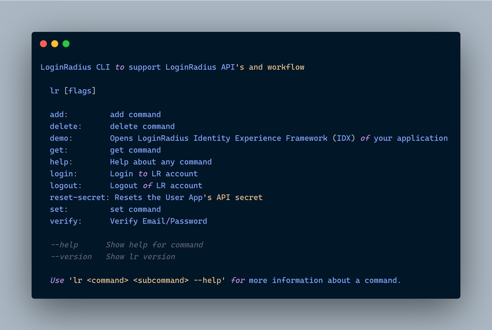

# LoginRadius CLI

`lr` is LoginRadius on the command line. You can perform basic actions of your [LoginRadius Dashboard](https://dashboard.loginradius.com/dashboard) through command line. The actions includes **login, register, logout, email configuration, domain whitelisting etc**.



# Documentation

[See the manual](https://www.loginradius.com/open-source/cli/manual) for more information related to the commands.
# Installation 
## MacOS and Linux

`lr` is available via [Homebrew](https://brew.sh/) and as a downloadable binary from the [release page](https://github.com/loginradius/lr-cli/releases/latest).

## Other Platforms

Download packaged binaries from the [release page](https://github.com/loginradius/lr-cli/releases/latest).
## Build from Source
### Installation from source

0. Verify that you have Go 1.16+ installed

   ```sh
   $ go version
   ```

   If `go` is not installed, follow instructions on [the Go website](https://golang.org/doc/install).

1. Clone this repository

   ```sh
   $ git clone https://github.com/LoginRadius/lr-cli.git
   $ cd lr-cli
   ```

2. Build and install
   #### Unix-like systems
   ```sh
   # installs to '/usr/local' by default; sudo may be required
   $ make install
   
   ```
   #### Windows
   ```sh
   # build the `bin\gh.exe` binary
   > go run script/build.go
   ```

   There is no install step available on Windows.

3. Run `lr --help` to check if it worked.

   #### Windows
   Run `bin\lr --help` to check if it worked.

## License

For more information on licensing, please refer to [License](https://github.com/LoginRadius/lr-cli/blob/master/LICENSE)